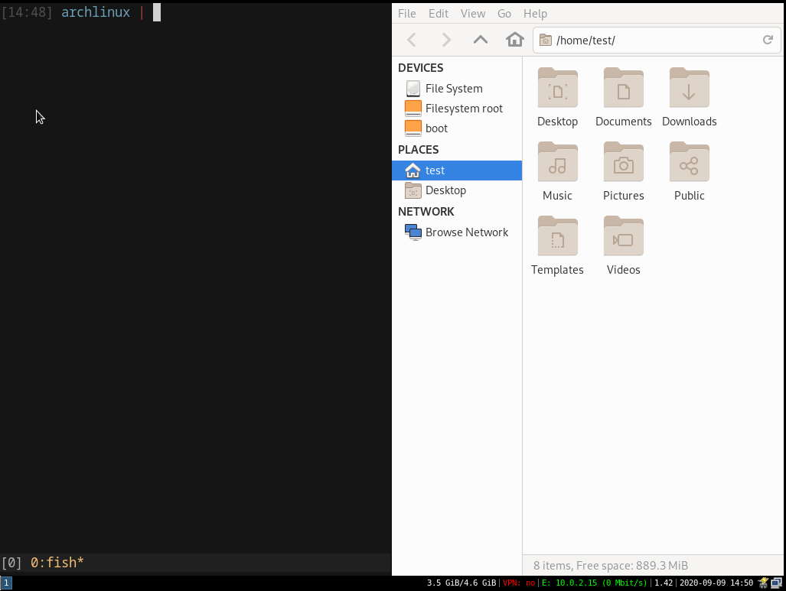

# arch-i3-usb

This [ALMA](https://github.com/r-darwish/alma) preset installs a fully usable and persistent Arch Linux system on a LiveUSB.

Note that the installation of the oh-my-zsh and MiniVim config files means the host computer must have internet access during image creation.

The preset files are simple TOML files which can be easily customised to add new packages or installation steps.

## FAQ

> Do I need to wipe the entire USB device when installing this?

Yes, until [this issue](https://github.com/r-darwish/alma/issues/46) is closed, ALMA will always format the device given (note that you can create an image for use with qemu for testing).

This is the main blocker for using ALMA as a general Arch Linux installer.


> Can I easily install AUR packages?

At the moment you would need to write a preset to install an AUR helper and call it in the scripts, or install the packages separately.

Ideally, this would be done in ALMA directly in the future as covered in [this issue](https://github.com/r-darwish/alma/issues/43).

> Can I install this on a normal hard disk? (not a LiveUSB)

ALMA supports non-removable disks, however it includes some LiveUSB optimisations (at the time of writing - mounting the disk without access times (noatime), a 16M volatile journal in RAM (to avoid disk writes), and disabling swap).

It will also **always reformat the entire disk** as mentioned above.

[This ALMA issue](https://github.com/r-darwish/alma/issues/40) should be closed to make these optimisations optional (you could also write a preset file to undo them).

> I want to set a different locale.

At the moment ALMA sets the locale to `en_US.UTF-8`. You could easily override this by adding a new preset, or create a PR to ALMA to allow custom locales there.

> You should add package X.

Please create a PR or issues for anything you think is missing!

## Screenshot




## Usage

Provide ALMA the preset directory, specifying the `ALMA_USER` and `TIMEZONE` environment variables:

i.e. for an image to use with qemu:

```bash
$ ALMA_USER="test" TIMEZONE="Europe/Madrid" sudo -E alma create --presets ./arch-i3-usb/preset --image 5GiB image_name.img
```

This can then be run in qemu via ALMA:

```bash
$ sudo losetup -f ./image_name.img
$ sudo losetup -j ./image_name.img
/dev/loop0: [2070]:6865917 (/path/to/image/image_name.img)
$ sudo alma qemu /dev/loop0
```

The `$ALMA_USER` and `$TIMEZONE` environment variables must be pased to ALMA. You will be asked to set the user password and root password during installation.

Full disk encryption can be enabled with the `-e` option, see the [ALMA](https://github.com/r-darwish/alma) documentation for more details.

i.e. to install on a target USB with full disk encryption (__this will wipe the target USB drive__):

```bash
$ ALMA_USER="test" TIMEZONE="Europe/Madrid" sudo -E alma create -e --presets ./arch-i3-usb/preset /dev/disk/by-id/usb-Generic_USB_Flash_Disk-0:0
```

The `preset/` directory contains a basic installation which will fit on an
8 GiB USB stick. If you have a larger disk it is highly recommended to
use the additional preset files in the `additional/` directory:

```bash
$ cp -rf additional/* preset/
```

The additional presets include many more useful utilities, and adds the
i3status-rust bar.

## What is included
### User
The user given by `ALMA_USER` is created with a home directory and XDG directories, and given passwordless sudo access.

The root password is also set during installation.

### Microcode

Both Intel and AMD microcode is installed (the correct one will be loaded on boot).

### Networking

NetworkManager and dhcpcd are installed.

nm-applet is run on startup.

### Video drivers

AMD, Intel and Nvidia (proprietary) drivers are installed. The correct one should be loaded according to your system.

### Window server

This preset uses Xorg, not Wayland. A Wayland installation could be created by modifying the Xorg and i3 components (for Wayland and sway respectively).

### PulseAudio

PulseAudio is installed. 

In the additional presets, bluez is installed for bluetooth headsets (use `bluetoothctl` to connect and pair devices).

pavucontrol can be launched with Meta+v to control the volumes and output devices.

### Virtual Terminal

alacritty is the default terminal emulator and can be launched with Meta+Enter.

Urxvt is also installed in the additional presets.

### Display Manager

i3 is installed, a sample configuration is included in this preset.

Meta+r can be used to launch programs via dmenu.

i3status is also installed as a status bar, a sample configuration is included in this preset.

### Text editors

vim and gvim are installed, along with the MiniVim configuration.

emacs and nano are also installed in the additional presets.

### Shell

fish is the default shell.

zsh is installed, along with the oh-my-zsh configuration.

### Web browsers

Firefox is installed.

In the additional presets, chromium is also installed, and
lynx and elinks are installed for use on the CLI.

### File management

thunar is installed, and can be launch with Meta+f.

### Filesystem tools

gparted and ntfs-3g are installed for working with NTFS partitions and resizing partitions.

### SSH

The openssh client is installed.

### git

git is installed.

### Multimedia

In the additional presets, mpd is installed for playing music,
along with the ncmpcpp and Ario frontends.
The default music directory is set to ~/Music.

mpv is installed in the additional presets.

### KeepassXC

In the additional presets, KeepassXC is installed for password databases.

